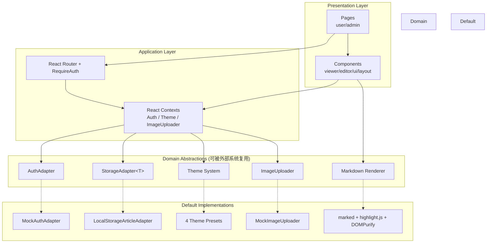

# 架构文档（ARCHITECTURE）

## 系统架构



## 数据流

### 创建文章流程

```
[MarkdownEditor] 
  → onChange(content)  ───────────────►  [Parent Component State]
  → onSave(content)  ─────────────────►  [StorageAdapter.update(id, { content })]
  → 图片按钮  ────────────────────────►  [ImageUploader.upload(file)]
                                          → url  ──►  插入  到编辑器
  → 自动保存（防抖 1.5s）  ────────────►  [StorageAdapter.update]
```

### 渲染文章流程

```
[ArticleDetailPage] 
  → getArticleStorage().getBySlug(slug)  ──►  [Article 对象]
  → <ArticleViewer content={article.content} />
       → renderMarkdown(content)  ─────►  marked → highlight.js → 自定义渲染器
       → DOMPurify.sanitize(html)  ───►  XSS 过滤
       → dangerouslySetInnerHTML  ───►  DOM
  → 增量 views  ──────────────────────►  storage.incrementViews(id)
```

### 主题切换流程

```
[ThemeSwitcher 组件]
  → onClick  ─►  setTheme(id)  ─►  [ThemeContext]
                                    ↓
                                    localStorage.setItem('blog-system:theme', id)
                                    document.documentElement.setAttribute('data-theme', id)
                                    ↓
                                    所有 CSS 变量重新计算
                                    所有依赖 CSS 变量的组件自动跟随
```

## 权限矩阵

| 资源/操作 | 公开 | `user` (2 权限) | `editor` (5 权限) | `admin` (8 权限) |
| --- | --- | --- | --- | --- |
| `GET /` | ✅ | ✅ | ✅ | ✅ |
| `GET /article/:slug` | ✅ | ✅ | ✅ | ✅ |
| `GET /login` | ✅ | ✅ | ✅ | ✅ |
| `article:read` | — | ✅ | ✅ | ✅ |
| `article:create` | — | ✅ | ✅ | ✅ |
| `article:edit` | — | — | ✅ | ✅ |
| `article:delete` | — | — | ✅ | ✅ |
| `article:publish` | — | — | ✅ | ✅ |
| `GET /admin` | ❌ (→ /login) | ❌ (→ 403) | ❌ (→ 403) | ✅ |
| `theme:manage` | — | — | — | ✅ |
| `user:manage` | — | — | — | ✅ |

## 扩展点

### 1. 主题扩展
- 位置：`src/lib/theme/presets.ts`
- 新增 `{ id, name, description, variables, preview }` 对象即可
- 同时在 `src/index.css` 添加 `:root[data-theme="<id>"]` 完整色板

### 2. 鉴权适配器扩展
- 位置：`src/lib/auth/` 下创建新的 `xxx.ts` 实现 `AuthAdapter` 接口
- 在 `App.tsx` 的 `<AuthProvider adapter={...}>` 注入
- 真实场景：JWT、OAuth、SSO、CAS

### 3. 存储适配器扩展
- 位置：`src/lib/storage/` 下创建 `xxx.ts` 实现 `ArticleStorageAdapter` 接口
- 修改 `src/lib/storage/index.ts` 的 `getArticleStorage()` 返回新实例
- 业务代码完全无感

### 4. 图床适配器扩展
- 位置：`src/lib/images/` 下创建新实现
- 支持七牛、阿里 OSS、腾讯 COS、AWS S3、自建服务
- 修改 `App.tsx` 的 `<ImageUploaderProvider uploader={...}>` 注入

### 5. 渲染器扩展
- 替换 `src/lib/markdown/render.ts` 即可
- 已实现：marked + highlight.js + DOMPurify
- 可替换为：react-markdown + rehype-raw + rehype-highlight

## 设计原则

1. **接口隔离**：每个领域能力都是独立接口，可单独替换
2. **Context 注入**：所有适配器通过 React Context 注入，避免硬编码
3. **类型驱动**：所有 API 用 TypeScript 类型定义，外部系统可享受类型提示
4. **CSS 变量驱动主题**：无运行时样式注入，开销最小
5. **Markdown 单一源**：内容用 Markdown 存储，渲染与编辑解耦
6. **错误边界**：根级 ErrorBoundary 防止单页崩溃导致整站白屏
7. **响应式优先**：所有布局在 320px 宽度下可用
