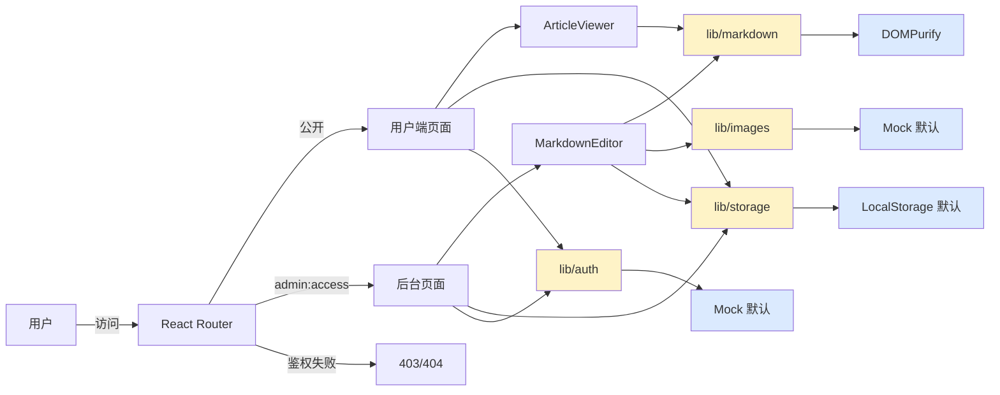

# 项目概览（OVERVIEW）

## 一页式架构图



## 导出类型清单

```ts
// src/lib/types.ts
export type Article = { ... }
export type ArticleStatus = 'draft' | 'published'
export type Author = { ... }
export type Role = 'admin' | 'editor' | 'user'
export type Permission =
  | 'article:read' | 'article:create' | 'article:edit'
  | 'article:delete' | 'article:publish'
  | 'admin:access' | 'theme:manage' | 'user:manage'
export type Theme = { id, name, description, variables, preview }
export type ThemeVariables = Record<string, string>

// src/lib/auth
export interface AuthAdapter { ... }
export interface AuthUser { ... }
export interface LoginCredentials { ... }
export function useAuth(): AuthContextValue
export { AuthProvider, MockAuthAdapter, listMockAccounts, listMockAccountsWithCredentials }

// src/lib/storage
export interface StorageAdapter<T extends { id: string }> { ... }
export interface ArticleStorageAdapter extends StorageAdapter<Article> { ... }
export function getArticleStorage(): ArticleStorageAdapter
export { SEED_ARTICLES, SEED_AUTHORS }

// src/lib/theme
export type { Theme, ThemeMode, ThemeVariables }
export function useTheme(): ThemeContextValue
export { ThemeProvider, themes }

// src/lib/markdown
export function renderMarkdown(md: string): string
export function sanitizeHtml(html: string): string

// src/lib/images
export interface ImageUploader { ... }
export interface UploadedImage { ... }
export function useImageUploader(): ImageUploaderContextValue
export { ImageUploaderProvider, MockImageUploader, HttpImageUploader }
```

## 公开组件清单

```ts
// src/components/editor
export { MarkdownEditor } from './MarkdownEditor'
export type { MarkdownEditorProps } from './MarkdownEditor'
export { MarkdownToolbar } from './MarkdownToolbar'
export { ImageUploadButton } from './ImageUploadButton'
export { useEditorState } from './useEditorState'

// src/components/viewer
export { ArticleViewer } from './ArticleViewer'
export type { ArticleViewerProps } from './ArticleViewer'
export { TableOfContents } from './TableOfContents'
export { ReadingProgress } from './ReadingProgress'
export { CodeBlock } from './CodeBlock'
export { Lightbox } from './Lightbox'

// src/components/ui
export { Button, Input, Textarea, Card, Dialog, Select, Badge,
         Switch, DropdownMenu, Tabs, Label, Toaster, ... }

// src/components/auth
export { RequireAuth } from './RequireAuth'

// src/components/theme
export { ThemeSwitcher } from './theme-switcher'

// src/components/layout
export { AppShell, Header } from '...'

// src/components
export { ErrorBoundary } from './ErrorBoundary'
```

## 关键页面截图清单

| 页面 | 路径 | 主要功能 |
| --- | --- | --- |
| 用户端首页 | `/` | Hero + 搜索 + 标签云 + 精选文章 + 卡片网格 |
| 文章列表 | `/articles` | 搜索 + 标签筛选 + 排序 + 分页 |
| 文章详情 | `/article/:slug` | 标题 banner + TOC + 阅读进度条 + 相关文章 |
| 登录页 | `/login` | 用户名/密码 + 演示账号提示 |
| 后台仪表盘 | `/admin` | 4 个统计卡（动画数字）+ 快速入口 + 最近文章 |
| 文章管理 | `/admin/articles` | 表格/卡片视图 + 筛选 + 搜索 + 批量操作 + 分页 |
| 文章编辑 | `/admin/articles/new` 或 `/admin/articles/:id/edit` | MarkdownEditor + 表单 + 操作栏 |
| 系统设置 | `/admin/settings` | 主题管理 Tab + 演示账号 Tab |

## 演示账号

| 账号 | 密码 | 角色 | 入口 |
| --- | --- | --- | --- |
| `admin` | `admin123` | admin | `/login` → `/admin` |
| `user` | `user123` | user | `/login` → `/`（`/admin` 被拦截） |

## 构建产物

| 文件 | 大小 | gzip |
| --- | --- | --- |
| `dist/index.html` | 0.5 KB | 0.4 KB |
| `dist/assets/index-*.css` | 34 KB | 7.5 KB |
| `dist/assets/index-*.js` | 2.0 MB | 675 KB |
| **总计** | **2.1 MB** | **683 KB** |

> 主 JS 偏大（包含 highlight.js 全部语言定义），如需优化可改造为按需加载语言包。
